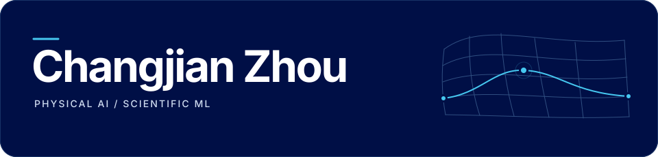

<picture>
  <source media="(prefers-color-scheme: dark)" srcset="./assets/banner-dark.svg">
  <source media="(prefers-color-scheme: light)" srcset="./assets/banner-light.svg">
  
</picture>

  <strong>Ph.D. student · The University of Melbourne</strong> 
  Faculty of Engineering and Information Technology · Melbourne, Australia

  <a href="https://zhouchaunge.github.io/"><strong>Academic homepage ↗</strong></a>
  &nbsp; · &nbsp;
  <a href="https://scholar.google.com/citations?user=t6bjRe0AAAAJ&hl=en">Google&nbsp;Scholar</a>
  &nbsp; · &nbsp;
  <a href="https://orcid.org/0009-0009-8481-4290">ORCID</a>
  &nbsp; · &nbsp;
  <a href="mailto:changjian.zhou@student.unimelb.edu.au">Email</a>

I build physics-aware models that learn from simulations and adapt to real-world data.

## Research interests

- **Physical AI & world models** — learned simulators and contact dynamics.
- **Scientific machine learning** — physics-informed learning and sim-to-real adaptation.
- **Computational mechanics** — granular dynamics, constitutive modelling, and inverse problems.

## Selected research software

<table>
  <tr>
    <td width="50%" valign="top">
      01 &nbsp; / &nbsp; SIM-TO-REAL
      <h3><a href="https://github.com/ZhouChaunge/PhysGuard">PhysGuard ↗</a></h3>
      
Fisher-guided gradient projection for physics-preserving adaptation of neural PDE surrogates.

      Scientific ML · Neural PDEs
    </td>
    <td width="50%" valign="top">
      02 &nbsp; / &nbsp; LEARNED SIMULATION
      <h3><a href="https://github.com/Data-Driven-Computational-Geotechnics/TRACE">TRACE ↗</a></h3>
      
Contact-memory graph networks for learned simulation of granular dynamics.

      Graph networks · Computational mechanics
    </td>
  </tr>
</table>

**Open-source contributions** · [DeepCopilot](https://github.com/deep-copilot/DeepCopilot), a coding agent for VS Code · [StructureClaw](https://github.com/structureclaw/structureclaw), LLM agents for structural engineering.

Publications, background, and collaborations → <a href="https://zhouchaunge.github.io/">zhouchaunge.github.io</a>

